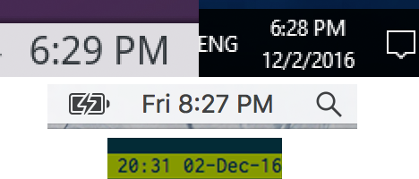
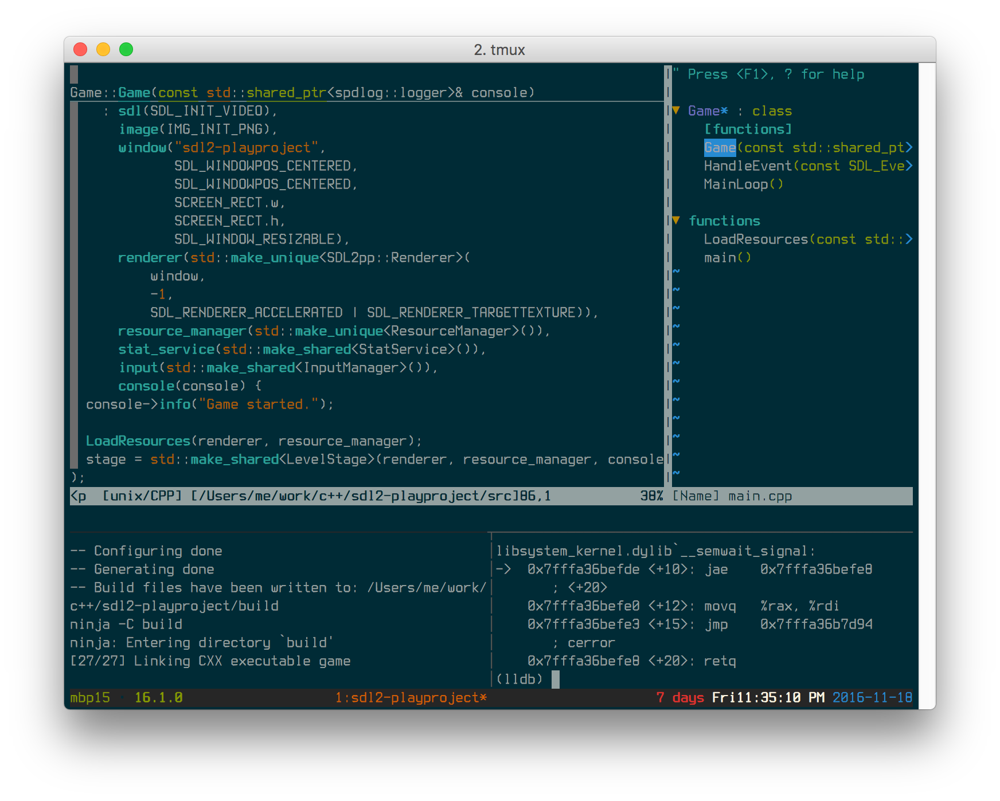
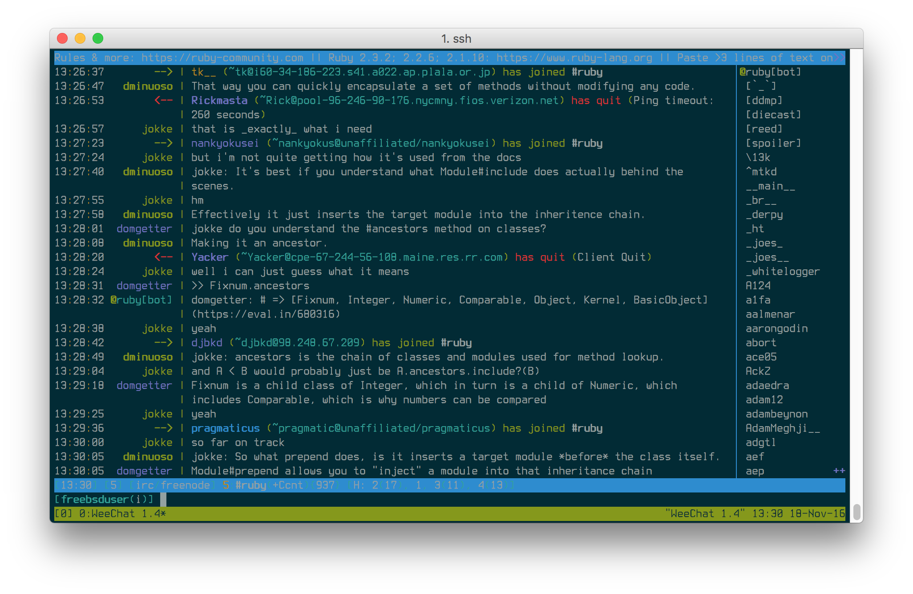

{mainmatter}

# Thinking in tmux {#thinking-tmux}

tmux is geared for developers and admins who interact regularly with CLI
(text-only interfaces)

In the world of computers, there are 2 realms:

1. The text realm
2. The graphical realm

tmux resides in the text realm. This is about fixed-width fonts and that old
fashioned black terminal.

## Window manager for the terminal

tmux is to the console what a desktop is to gui apps. It's a world inside the
text dimension. Inside tmux you can:

- multitask inside the terminal, run multiple applications
- have multiple command lines (pane) in the same window
- have multiple windows (window) in the workspace (session)
- switch between multiple workspaces, like virtual desktops

|**tmux**           |**"Desktop"-Speak**   |**Plain English**                  |
|-------------------|----------------------|-----------------------------------|
|Multiplexer        |Multi-tasking         |Multiple applications              |
|                   |                      |simulataneously.                   |
|-------------------|----------------------|-----------------------------------|
|Session            |Desktop               |Applications are visible here      |
|-------------------|----------------------|-----------------------------------|
|Window             |Virtual Desktop or    |A desktop that stores it own screen|
|                   |applications          |screen			       |
|-------------------|----------------------|-----------------------------------|
|Pane               |Application           |Performs operations                |

Heck, you even get a clock. Just like in a graphical desktop environment.

## Multitasking

{width=50%,float=right}

tmux gives you prime oppurtunity to do many things at once on the same screen.

For one you can keep multiple terminals running on the same display.

But you also have the concept of shuffling between multiple "windows" within
that, all within the confines of the tmux session you attached.

Even better, there are facilities to copy and paste, scroll. No requirement
for graphics either, so you have full power even if you're SSH'ing or in a
tty without X.

So here are a few common scenarios:

A system administrator will run a `tail -F /var/log/apache2/error.log` in a
pane to get a live stream of the latest system events.

Running a file watcher like [watchman](https://github.com/facebook/watchman),
[gulp-watch](https://github.com/gulpjs/gulp/blob/master/docs/API.md#gulpwatchglob-opts-tasks),
[grunt-watch](https://github.com/gruntjs/grunt-contrib-watch), [guard](https://github.com/guard/guard)
or [entr](http://entrproject.org/). On file change, you could do stuff like:

- rebuild LESS or SASS files, minify CSS and/or assets and static files
- linting with linters like [cpplint](https://github.com/google/styleguide/tree/gh-pages/cpplint),
  [Cppcheck](http://cppcheck.sourceforge.net/), [rubocop](https://github.com/bbatsov/rubocop),
  [ESLint](http://eslint.org/) or [Flake8](http://flake8.pycqa.org/en/latest/)
- rebuilding with `make` or `ninja`
- reload your [Express](http://expressjs.com/) server
- any other custom command to your liking

Keeping a text editor like vim, emacs, pico, nano, etc. open in a main pane,
while leaving two other open for CLI commands and building via `make` or
`ninja`.

You can see with tmux, you very quickly have the makings of an IDE! And it's on
your terms.

## Keep your applications running in the background

{width=50%,float=right}

Sometimes in GUI applications you'll have an option to minimize and application
to a tray ground.  The application is out of the sight, but running in the
background.

In tmux, a similar concept exists where we can "detach" a tmux session.

This is especially cool if:

- On a local machine, you start all your normal terminal applications within
  a tmux session, you restart X. Instead of losing your processes as your
  normally would if you were using an X terminal like xterm or konsole, you'd
  be able to `tmux attach` after and find all processes were alive and kicking
  all along :)
- Same applies for remote SSH applications and workspaces you run in tmux. You
  can detach your tmux workspace at work before you clock out, then next morning
  reattach your session. Ahhh. Refreshing. :) Heck, sometimes you may have one
  of those rare servers you rarely log into. Funny story, I once had caching
  front end on AWS I totally forgot about. 9 months later I connect, and as if
  it was a reflex, `tmux attach` to see if there we anything on there. And boom,
  I'm in a session that's 9 months old. Surprisingly no memory leaks.

Chatting on [irssi](https://irssi.org/) or [weechat](https://weechat.org/),
one of the "classic combos", along with a [bitlbee](https://www.bitlbee.org)
server to manage AIM, MSN, Google Talk, Jabber, ICQ, even twitter. Then you can
detach your IRC and "idle" in your favorite channels, stay online on instant
messengers, and get back to your messages when you return.

I've even see people (myself included) use it to keep development servers
running. Hearty emphasis on *development*, I would advise daemonizing and
wrapping your production web applications using a tool like
[supervisor](http://supervisord.org/) with its own safe environmental
settings.

You can also have multiple users attach their clients to the same sessions.
Which is great for pair programming.  If you were in the same session, you
and the other person would see the same thing, share the same input, and the
same active window and pane.

The above is just examples, but any general workspace you'd normally use in a
terminal for any task can gain the benefit of you being able to persist it! 
That includes projects or repetitive efforts you'd multitask on.

Q> ### Does tmux persist sessions after restarts?
Q>
Q> Unfortunately not. A restart will kill the tmux server and any processes
Q> running within it.
Q>
Q> Thankfully, the modern server can stay online for a long time. Even for
Q> consumer laptops and PC's with a day or two uptime, having tmux persist
Q> tasks for organizational purposes is satisfactory to run it.
Q>
Q> For tasks you repeat often, you can always use a tool like
Q> [tmuxp](https://github.com/tony/tmuxp), [tmuxinator](https://github.com/tmuxinator/tmuxinator)
Q> or [teamocil](https://github.com/remiprev/teamocil) to resume common
Q> sessions.
Q>
Q> It comes at a disappointment, because some are interested in the idea of
Q> being able to persist a tree of processes after restart. That goes out of
Q> scope of what tmux is meant to do.
