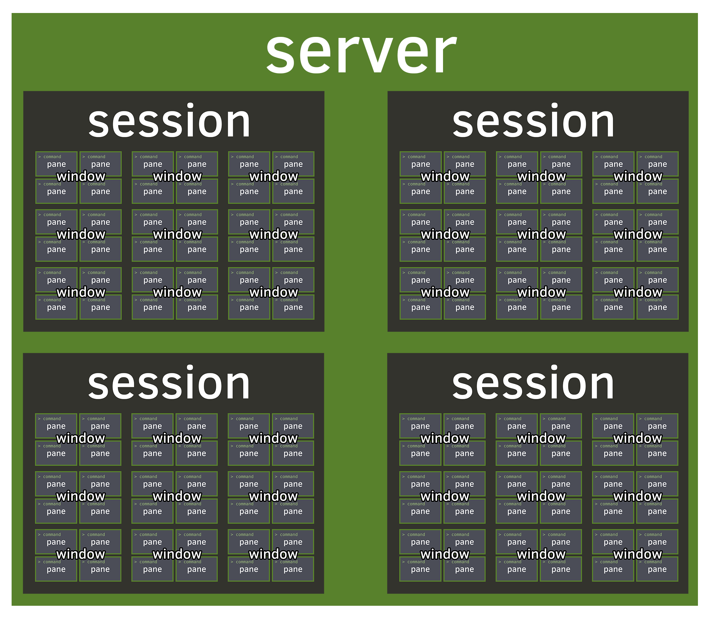

# Server {#server} 

The server holds [sessions](#sessions) and the [windows](#windows) and
[panes](#panes) within them.

When tmux starts you are connected to a server via a socket connection.
What you see presented to you in your shell is merely a client connection. In
this chapter, we go into the one of the secret sauces that allow your terminal
applications to persist for months or even years if you want to.

{width=90%}

## What? tmux is a server?

Often when "server" is mentioned what comes to mind for many
may be rackmounted hardware, to others it may be software running
daemonized on a server and managed through a utility like upstart,
supervisor and so on.

Unlike web or database software, tmux doesn't require specialized
configuration settings or creating a service entry to start things.

tmux uses a client-server model, but the server is forked to the 
background for you.

## Zero config needed

You don't notice it, but when you use tmux normally, a server is launched and
being connected via a client.

tmux is so streamlined the book could continue to explain usage and not even
mention servers. But I'd rather you have a solid understanding that while tmux
feels like magic, it's utilitarian first and foremost. One cannot deny it's
exquisitely executed from a user experience standpoint.

How is it utilitarian? We'll go into it more in future chapters where we dive
into [Formats](#formats), [Targets](#targets) and tools such as [libtmux](https://github.com/tony/libtmux)
that I made which utilize these features.

It surprises some because servers often beget a setup process. But servers being
involved doesn't necessarily entail hours of configuration on each machine you
run on. There's no setup.

When people think server, they think pain. It invokes an image of digging
around `/etc/` for configuration files and flipping settings on and off just to
get basic systems online. But not with tmux. It's a server, but in the good way.

## Stayin' alive

The server part of tmux is how your sessions are able to stay alive even
after your client is detached.

You can detach a tmux session from an SSH server and reconnect at a later time.
You can detach a tmux session, stop your X server in Linux/BSD, and reattach
your tmux session in a TTY or new X server.

The tmux server won't go away until all sessions are closed first.

## Servers hold sessions

One server can contain one or multiple [sessions](#sessions).

Recurring usage of tmux after a server already exist will create a new
session inside that server. 

W> ### Advanced: Multiple servers
W>
W> tmux is nimble. If you want to use a separate server, pass in
W> the `-L` flag to any command.
W>
W> `tmux -L moo` - connect to server under socket name "moo" and attach
W> a new session. Create server if none already exists for socket.
W>
W> `tmux -L moo attach` try to re-attach to session if one exists

## How servers are "named"

The default name for the server is `default`, which is stored as a socket in
`/tmp`. The default directory for storing this can be overridden via setting
the `TMUX_TMPDIR` environment variable.

So something like:

{language=shell, line-numbers=off}
    $ export TMUX_TMPDIR=$HOME
    $ tmux

Will give you a tmux directory created within your `$HOME` folder. On OS X,
your home folder will probably be something like `/Users/yourusername`. On
other systems it may be `/home/yourusername`. If you want to find out, type
`echo $HOME`.

## Clients

Servers will have clients (you) connecting to them.

When you connect to a session and see windows and panes, it's a client
connection into tmux.

You can retrieve a list of active client connections via:

{language=shell, line-numbers=off}
    $ tmux list-clients

These commands in practice are rather rare. As well as the other `list-`
commands for that matter. But they are part of the tools that make tmux highly
scriptable should you want to get creative. You can learn more about that in
[formats](#formats).

## Clipboard

tmux clients wield a powerful clipboard feature you can use to copy and paste
across sessions, windows and panes.

Much like vi, tmux handles clipboard as a mode (or a state) which a pane is
temporarily placed in while text can be copied.

The default key to enter copy mode is `Prefix` + `[`.

1. From within, use `[space]` to enter copy mode.
2. Use the arrow keys to adjust the text to be selected.
3. Press `[enter]` to copy the selected text.

The default key to paste the text copied is `Prefix` + `]`.

I> *Vi-like copy-paste*
I>
I> In your [config](#config), put this:
I>
I> {language=shell, line-numbers=off}
I>     # Vi copypaste mode
I>     set-window-option -g mode-keys vi
I>     bind-key -t vi-copy 'v' begin-selection
I>     bind-key -t vi-copy 'y' copy-selection

## Summary

One of the fundamental underpinning of tmux is the server. For the most part,
the server is invisible to the user. 

The server can hold one or more *sessions*. You can copy and paste between
sessions via the clipboard. In the next chapter we will go deeper into the role
sessions play and how they help your organize and control your terminal
workspace.
