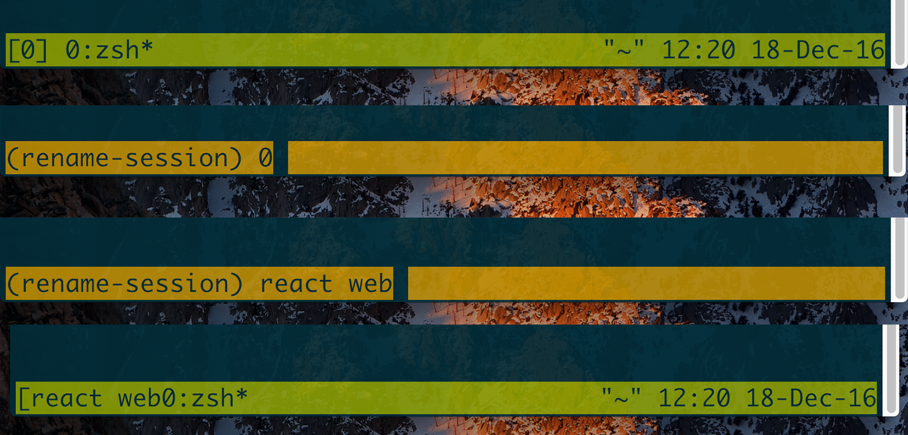

# Sessions {#sessions}

Welcome to the session, the highest-level entity residing in the [server](#server)
instance. Server instances are forked to the background upon starting a fresh
instance and reconnected to when reattaching sessions. Your interaction with
tmux will have *at least* one session running.

A session holds one or more [windows](#windows). 

The active window will have a `*` symbol next to it.

## Creating a session

The simplest command to create a new session is typing `tmux`:

{language=shell, line-numbers=off}
    $ tmux

The `$ tmux` application, with no commands is equivalent to
`$ tmux new-session`. Nifty!

By default, your session name will be given a number, which isn't too
descriptive. What would be better is:

{language=shell, line-numbers=off}
    $ tmux new-session -s'my rails project'

## Switching sessions within tmux

Some acquire the habit of detaching their tmux client and reattaching via
`tmux att -t session_name`. Thankfully, you can switch sessions from within
tmux!

| Shortcut         | Action                                             |
|------------------|----------------------------------------------------|
|`Prefix` + `(`    | Switch the attached client to the previous session.|
|`Prefix` + `)`    | Switch the attached client to the next session.    |
|`Prefix` + `L`    | Switch the attached client back to the last        |
|                  | session.                                           |
|`Prefix` + `s`    | Select a new session for the attached client       |
|                  | interactively.                                     |

`Prefix` + `s` will allow you to switch between sessions within the same tmux
client.

This command name can be confusing. `switch-client` will allow you to traverse
between sessions in the [server](#server).

Example usage:

{language=shell, line-numbers=off}
    $ tmux switch-client -t dev

If already inside a client, this will switch to a session, named "dev", if it exists.

## Naming sessions

Sometimes, the default session name given by tmux isn't descriptive enough. It
only takes a few seconds to update it.

You can name it whatever you want. Typically, if I'm working on multiple web
projects in one session, I'll name it "web". If I'm assigning one software
project to a single session, I'll name it after the software project. You'll
likely develop your own naming conventions, but anything is more descriptive
than the default. 

If you don't name your sessions, it'll be difficult to keep track of what the
session contains. Sometimes, you may forget you have a project opened, 
especially if your machine has been running for a few days, weeks, or months.
You can save time by reattaching your session and avoid creating a duplicate.

You can rename sessions from within tmux with `Prefix` + `$`.  The status bar
will be temporarily altered into a text field to allow altering the session
name.

Through command line, you can try:

{language=shell, line-numbers=off}
    $ tmux rename-session -t 1 "my session"

## Does my session exist?

If you're scripting tmux, you will want to see if a session exists.
`has-session` will return a 0 [exit code](https://en.wikipedia.org/wiki/Exit_status)
if the session exists, but will report a 1 exit code *and* print an error if a
session does not exist.

{language=shell, line-numbers=off}
    $ tmux has-session -t 1

It assumes the session "1" exists; it'll just return 0 with no output.

But if it doesn't, you'll get something like this in a response:

{language=shell, line-numbers=off}
    $ tmux has-session -t 1
    > can't find session 1

To try it in a shell script:

{language=shell, line-numbers=off}
    if tmux has-session -t 0 ; then
        echo "has session 0"
    fi

## Summary

In this chapter, you learned how to rename sessions for organizational purposes
and how to switch between them quickly.

You'll always be attached to a session when you're using a client in tmux. When
the last remaining session is closed, the server will close also.

Think of sessions as workspaces designed to help organize a set of windows,
analogous to [virtual desktop](https://en.wikipedia.org/wiki/Virtual_desktop)
spaces in GUI computing.

In the next chapter, we will go into *windows*, which, like sessions, are also
nameable and let you switch between them.
