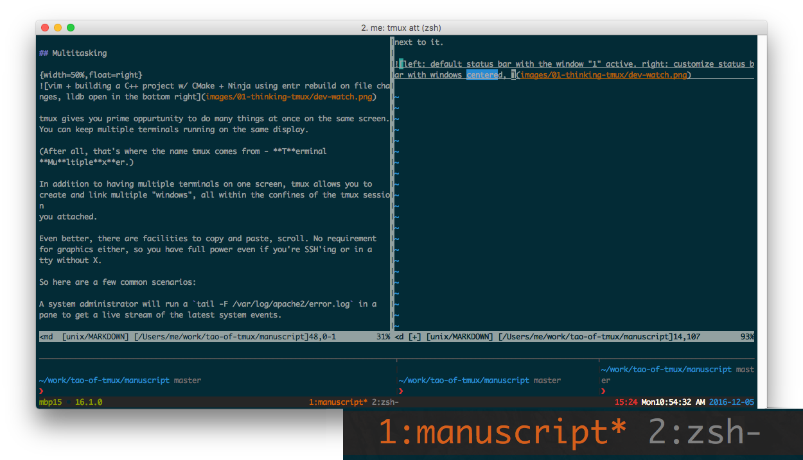

# Session {#sessions}

Welcome to the session. Being the highest level entity after your
[server](#server). Regardless of whether you're starting tmux fresh
or attaching an already created one, your interaction with tmux will
have to have at least one session running.

A session will hold one or more [windows](#windows). Your tmux status bar,
found at the bottom, will include a list of windows.

The window you have selected currently may have a special color or a `*` symbol
next to it.

## Switching sessions within tmux

`Ctrl-b s` will allow you to switch between sessions within the same tmux
client.

## Renaming tmux windows

### Keystroke

You can rename sessions with `Ctrl-b $`.  The status bar will be temporarily
altered into a text field to allow altering the session name.

### Command line

{language=shell, line-numbers=off}
    $ tmux rename-session [-t target-session] new-name
