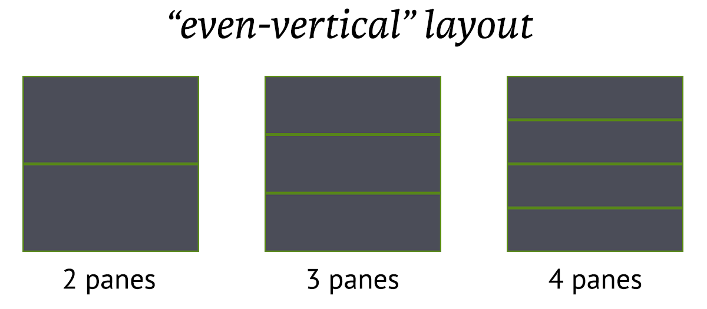
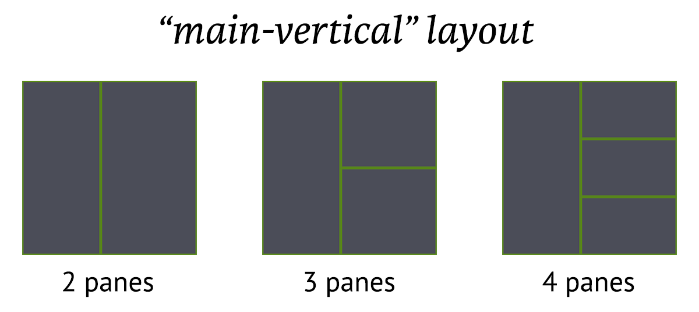
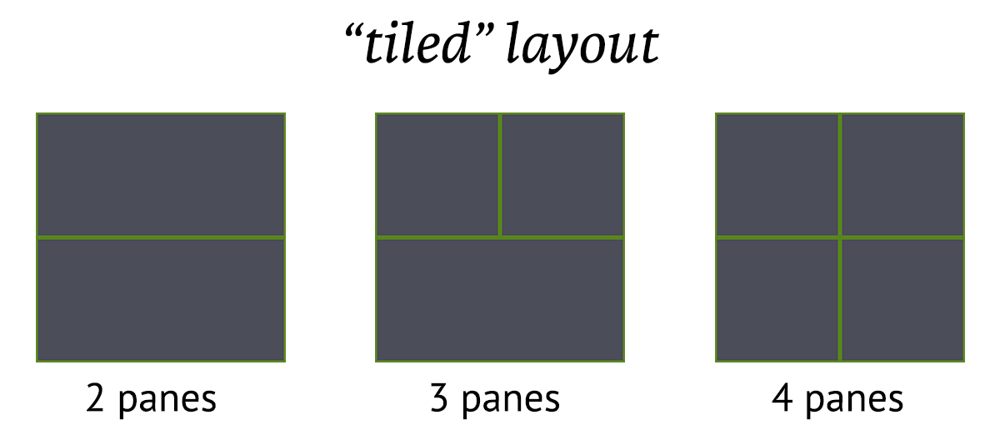

# Windows {#windows}

Windows hold [panes](#panes). They reside within a [session](#sessions).

They also have [layouts](#window-layouts), which can be one of many preset
dimensions or a custom one done through [pane resizing](#pane-resizing).

You can see the current open windows through the [status bar](#status-bar).

## Naming windows

Just like with sessions, windows can have names. Labelling them helps keep track
of what you're doing inside them.

When inside tmux, the most common way of doing that is `Prefix` + `,`. This will
open a prompt in the tmux status line where you can alter the name of the
current window.

## Traversing Windows

`Prefix` + `1`, `Prefix` + `2`, and so on... will get you to navigate to windows
by their index.

Prompt for a window index (useful for indexes greater than 9) with `Prefix` +
`'`.

I> ### POWER MOVE: Search + Traverse Windows for Text
I> 
I> You can forward to a window with a match of a text string by doing `Prefix` +
I> `f`.

You can move to the last selected window with `Prefix` + `l`.

You can bring up a list of current windows with `Prefix` + `w`. The benefit of
this is it also gives you some info on what's inside the window. Helpful if
you're juggling around a lot of things!

## Moving Windows

`$ tmux move-window` can be used to move windows.

The accepted arguments are `-s` (the window you are moving) and `-t`, where you
are moving the window to.

You can also use `$ tmux movew` for short.

Example: move the current window to number 2:

{language=shell, line-numbers=off}
    $ tmux movew -t2

Example: move window 2 to window 1:

{language=shell, line-numbers=off}
    $ tmux movew -s2 -t1

The shortcut to prompt for an index to move the current window to is `Prefix` +
`.`.

## Layouts {#window-layouts}

`Prefix` + `space` switches window *layouts*. These are preset configurations
which handle proportions of [panes](#panes).

As of tmux 2.3, the supported layouts are:

{width=75%}

{width=75%}

{width=75%}

{width=75%}

{width=75%}

Specific touch-ups can be done via [resizing panes](#resizing-panes).

To reset the proportions of the layout (such as after splitting or resizing
panes), you have to run `$ tmux select-layout` again for the layout.

This is different behavior than some [tiling window managers](https://en.wikipedia.org/wiki/Tiling_window_manager).
[awesome](https://awesomewm.org/) and [xmonad](http://xmonad.org/), for
instance, automatically handle proportions upon new items being added to their
layouts.

To allow easily resetting to a sensible layout across machines and terminal
dimensions, you can try this in your [config](#config):

{language=shell, line-numbers=off}
    bind m set-window-option main-pane-height 60\; select-layout main-horizontal

This allows you to set a `main-horizontal` layout and automatically set the
bottom panes proportionally on the bottom everytime you do `Prefix` + `m`.

Layouts can also be totally custom. To get the custom layout snippet for your
current window, try this:

{language=shell, line-numbers=off}
    $ tmux lsw -F "#{window_active} #{window_layout}" | grep "^1" | cut -d " " -f2

To apply that layout, do this:

{language=shell, line-numbers=off}
    $ tmux lsw -F "#{window_active} #{window_layout}" | grep "^1" | cut -d " " -f2
    > 5aed,176x79,0,0[176x59,0,0,0,176x19,0,60{87x19,0,60,1,88x19,88,60,2}]

    # resize your panes or try doing this in another window to see the outcome
    $ tmux select-layout "5aed,176x79,0,0[176x59,0,0,0,176x19,0,60{87x19,0,60,1,88x19,88,60,2}]"

## Closing windows

From inside the current window, try this:

{language=shell, line-numbers=off}
    $ tmux kill-window

Another thing, when [scripting](#scripting-tmux) or trying to kill the window
from outside, use a [target](#targets) of the window index:

{language=shell, line-numbers=off}
    $ tmux kill-window -t2

You can easily find the window index through the middle section of the [status
line](#status-line).
