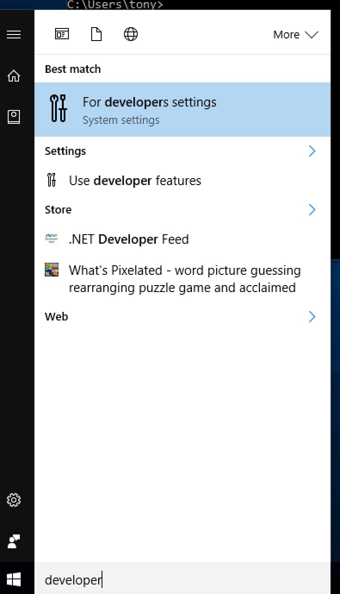
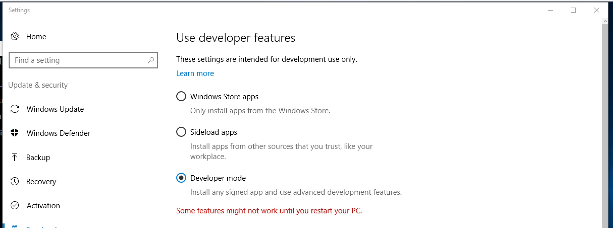
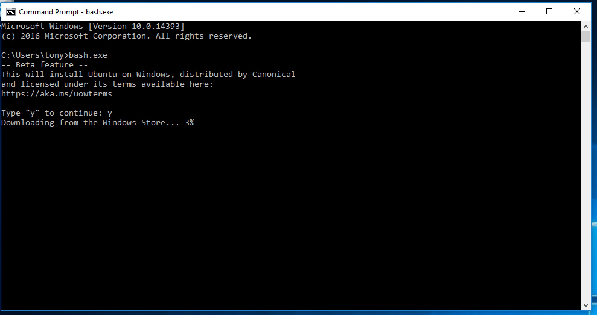
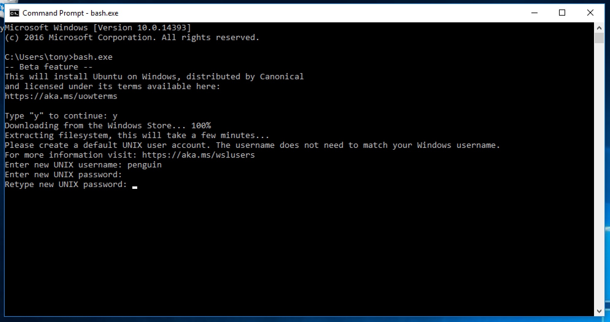
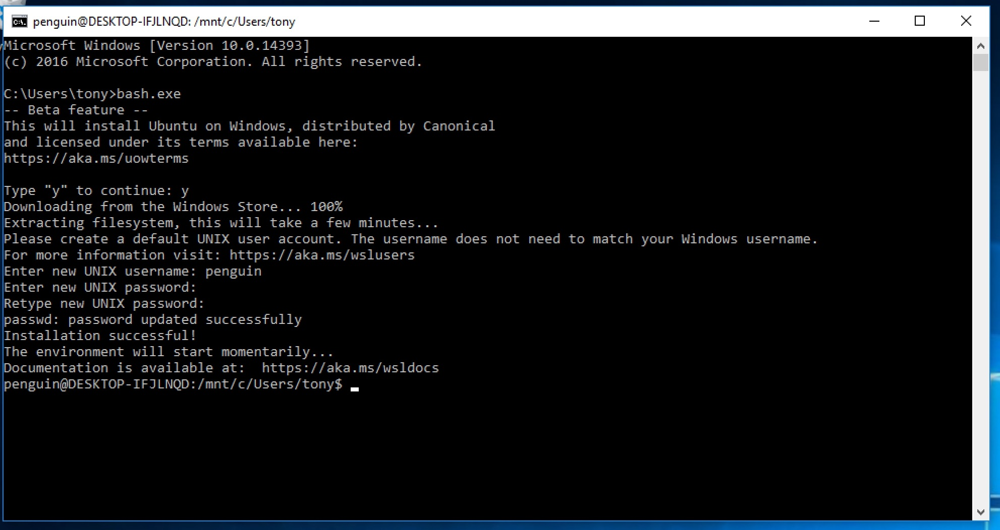

# Appendix: tmux on Windows 10 {#appendix-windows-bash}

As of Windows 10 build 14361 [^win10bashbuild] you can run tmux via the Linux Subsystem feature.

Usage requires enabling **Developer mode** via the "For Developers" tab in the "Update & security" settings.

After you enable that, you open up "Windows Features", you can find it by searching for "Turn Windows features on or off".  Then check "Windows Subsystem for Linux (Beta)".

You may be asked to restart.

Then open up Command Prompt as you normally would (Run cli.exe). Then type

    C:\Users\tony> bash.exe

It will prompt you to agree to terms, create a user. In my build, tmux was already installed! But if it's not, type `sudo apt-get install tmux`.

{width=50%,float=left}

{width=50%,float=left}

{width=50%,float=left}

{width=50%,float=left}

{width=100%,float=left}

{width=100%,float=left}

{width=100%,float=left}

{width=100%,float=left}

    yourusername@COMPUTERNAME-ID321FJ:/mnt/c/Users/username$ tmux

{width=100%,float=left}

[^win10bashbuild]: https://blogs.msdn.microsoft.com/commandline/2016/06/08/tmux-support-arrives-for-bash-on-ubuntu-on-windows/
